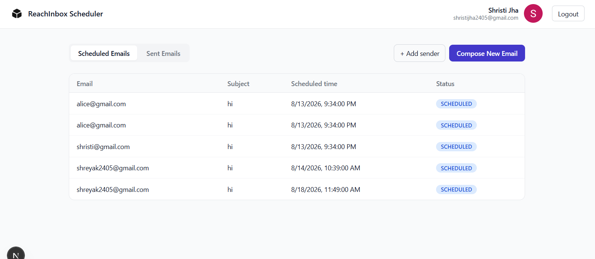
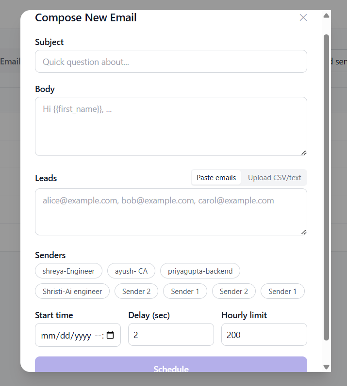
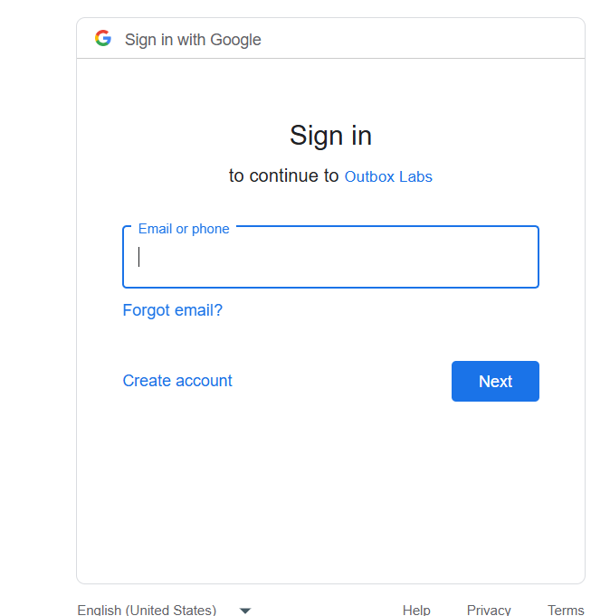

# ReachInbox Scheduler

A full-stack email scheduling application that lets users upload recipient lists, compose emails, schedule them for a specific time, and track scheduled and sent emails from a simple dashboard.

Built with **Next.js, Express, PostgreSQL, Redis, BullMQ and NextAuth**.

---

## Screenshots

### Dashboard



### Compose Email



### Google Login



---

## Features

* Google OAuth login
* Schedule emails for a specific time
* Upload CSV/text files and automatically extract email addresses
* Configure delay between emails
* Set hourly email limits for each sender
* Support multiple senders
* Scheduled and Sent email views
* BullMQ delayed jobs instead of cron
* PostgreSQL persistence
* Redis-backed rate limiting
* Automatic rescheduling when an hourly limit is reached
* Restart-safe job reconciliation
* Idempotent email scheduling
* Retry with exponential backoff
* Ethereal Email integration for testing

---

## Tech Stack

| Layer                 | Technology                               |
| --------------------- | ---------------------------------------- |
| Frontend              | Next.js, React, TypeScript, Tailwind CSS |
| Authentication        | NextAuth + Google OAuth                  |
| Backend               | Node.js, Express, TypeScript             |
| Database              | PostgreSQL + Prisma                      |
| Queue                 | BullMQ                                   |
| Cache / Rate Limiting | Redis                                    |
| Email                 | Nodemailer + Ethereal                    |

---

## How It Works

The application is split into a frontend, API server and background worker.

```text
             ┌─────────────────────┐
             │      Next.js        │
             │     Dashboard       │
             └──────────┬──────────┘
                        │
                     REST API
                        │
                        ▼
             ┌─────────────────────┐
             │      Express        │
             │        API          │
             └─────────┬───────────┘
                       │
              ┌────────┴────────┐
              │                 │
              ▼                 ▼
       ┌─────────────┐    ┌─────────────┐
       │ PostgreSQL  │    │    Redis     │
       │   Database  │    │   BullMQ     │
       └─────────────┘    └──────┬──────┘
                                  │
                                  ▼
                         ┌─────────────────┐
                         │  BullMQ Worker  │
                         └────────┬────────┘
                                  │
                                  ▼
                           Ethereal SMTP
```

PostgreSQL is the **source of truth** for email jobs.

Redis and BullMQ handle the timing and execution of those jobs.

When an email is scheduled, an `EmailJob` is stored in PostgreSQL and a corresponding delayed BullMQ job is created.

---

## Scheduling

The scheduler doesn't use cron or polling.

When a batch is created:

1. The uploaded file is parsed and email addresses are extracted.
2. An `EmailJob` is created for each recipient.
3. Each job gets a scheduled time.
4. The job is added to BullMQ as a delayed job.
5. Redis holds the delayed job until it is ready.
6. The worker processes the job and sends the email.

The BullMQ `jobId` is the same as the PostgreSQL `EmailJob.id`. This prevents the same database job from being queued multiple times.

---

## Rate Limiting

The system has two levels of rate control.

**Minimum delay**

BullMQ limits how frequently jobs are processed. The default minimum delay is **2 seconds between sends**.

**Hourly sender limit**

Each sender has its own hourly limit. Redis keeps track of the number of emails sent by each sender during the current UTC hour.

The counter is updated atomically using a Redis Lua script so concurrent workers cannot accidentally exceed the limit.

If a sender reaches the hourly limit, the email isn't dropped. The job is moved to the next available hour and marked as `RESCHEDULED` in PostgreSQL.

---

## Restart Safety

The database and queue are intentionally separated.

PostgreSQL stores all pending jobs, while Redis stores the BullMQ queue.

When the API starts, a reconciliation process checks PostgreSQL for pending jobs and makes sure their corresponding BullMQ jobs exist.

If a queue job is missing, it is recreated.

Because the database ID is used as the BullMQ job ID, this can happen safely without creating duplicate jobs.

---

## Idempotency

There are two checks to prevent duplicate emails:

* BullMQ uses `EmailJob.id` as the job ID.
* The worker checks the database status before sending.

If a job has already been marked as `SENT`, the worker will not send it again.

---

## Project Structure

```text
reachinbox-scheduler/
│
├── backend/
│   ├── prisma/
│   └── src/
│       ├── services/
│       ├── workers/
│       └── ...
│
├── frontend/
│   ├── public/
│   └── src/
│       ├── app/
│       ├── components/
│       └── lib/
│
├── screenshots/
│   ├── dashboard.png
│   ├── compose.png
│   └── login.png
│
└── README.md
```

---

## Getting Started

### Prerequisites

Make sure you have:

* Node.js
* Docker Desktop
* PostgreSQL
* Redis

Docker can be used to run PostgreSQL and Redis.

### 1. Start the infrastructure

From the project root:

```bash
docker compose up -d
```

This starts:

```text
PostgreSQL → 5432
Redis      → 6379
```

### 2. Setup the backend

```bash
cd backend
npm install
```

Create your environment file:

```bash
cp .env.example .env
```

Run the database migration:

```bash
npm run prisma:migrate
```

Create test Ethereal senders:

```bash
npm run seed:ethereal -- --count 2
```

Start the API:

```bash
npm run dev
```

The API runs on:

```text
http://localhost:4000
```

In another terminal, start the worker:

```bash
npm run worker
```

### 3. Setup the frontend

```bash
cd frontend
npm install
```

Create your local environment file:

```bash
cp .env.local.example .env.local
```

Add your Google OAuth credentials and NextAuth secret to `.env.local`.

For Google OAuth, use:

```text
http://localhost:3000/api/auth/callback/google
```

Then start the frontend:

```bash
npm run dev
```

Open:

```text
http://localhost:3000
```

---

## Email Testing

The project uses **Ethereal Email** so emails can be tested without connecting a real SMTP provider.

Run:

```bash
npm run seed:ethereal -- --count 2
```

The command creates disposable SMTP accounts.

After sending an email, Ethereal provides a preview URL where the message can be viewed.

---

## Configuration

The main configuration values include:

```env
DATABASE_URL=
REDIS_URL=

GOOGLE_CLIENT_ID=
GOOGLE_CLIENT_SECRET=
NEXTAUTH_SECRET=

WORKER_CONCURRENCY=5
MIN_DELAY_BETWEEN_SENDS_MS=2000
MAX_EMAILS_PER_HOUR_PER_SENDER=
```

Keep the actual values in `.env` / `.env.local`. They should not be committed to GitHub.

---

## Current Scope

The current version focuses on the core scheduling workflow:

**Google Login → Compose → Schedule → Queue → Send → Track Status**

The API already supports pagination, while the dashboard currently displays the first page of results.

Backend API authentication is also kept lightweight for the current scope. In a production deployment, the NextAuth session/JWT would be verified by the backend as well.

---

## Future Improvements

* Pagination controls in the dashboard
* Cancel or reschedule existing emails
* Per-user sender management
* Production email provider integration
* Delivery and bounce tracking
* Backend authentication and authorization
* Automated tests for scheduling and rate limiting
